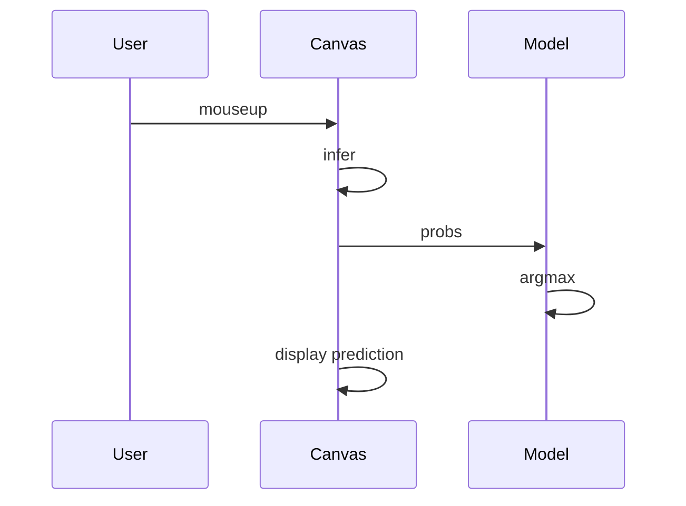

# ABOUT
- Resume/Portfolio website using Vue (Nuxt 3) extends from [codewithsadee](https://github.com/codewithsadee/vcard-personal-portfolio) and [agcrisbp](https://github.com/agcrisbp/ADResume).

# INSTALLATIONS REQUIRED FOR UBUNTU

1. Clone this repo:
```
git clone https://github.com/nleboucher/portfolio
```


2. Install Node.js and npm

```
sudo apt update
sudo apt install nodejs
sudo apt install npm
```
3. Install pnpm

```
npm install -g pnpm@7.9.0
```

4. (Optional) Install TypeScript

```

npm install -g typescript@5.1.6
```

5. (Optional) Install ESLint

```
npm install -g eslint@8.45.0
```
6. (Optional) Install Vue CLI

```
npm install -g @vue/cli
```
7. (Optional) Install Git

```
sudo apt install git
```
8. (Optional) Install Python 2

```
sudo apt-get install python2
```
9. (Optional) Install build-essential

```
sudo apt-get install build-essential
```
10. (Optional) Install libssl-dev

```
sudo apt-get install libssl-dev
```
11. (Optional) Install libpng-dev

```
sudo apt-get install libpng-dev
```

12. Install all the dependencies:
```
npm install
```

13. Run the project:
```
npm run dev
```

14. Edit all my information & deploy
```
code .
```

---
# PROJECTS:
- 1 Live Image Classifier Demo
    The canvas element is a rectangular area of the webpage that can be used to draw graphics. It is often used for games, animations, and other interactive content.

The canvas works by creating a bitmap image, which is a grid of pixels. Each pixel is represented by a color value. The canvas element can be used to draw shapes, lines, and text on the bitmap image.

When the user stops drawing on the canvas, the canvas element fires a "mouseup" event. This event is handled by the JavaScript code, which calls the infer() method of the Canvas class. The infer() method uses the machine learning model to predict the digit that was drawn. The prediction is then displayed on the web page.

The following is a more detailed pipeline of the information from the moment the user stops drawing the digits to the moment the digits is recognized and the result is shown:


    